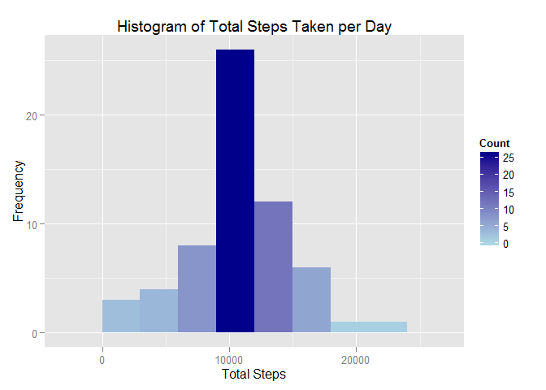

# Reproducible Research: Peer Assessment 1

Peer Assessment 1 for Reproducible Research at John Hopkins Bloomberg School
of Public Health on Coursera. The following steps will reproduce the required
data for this assignment. This assignment requires `dplyr` library in order to
process data, and `ggplot2` to produce charts.

## Loading and preprocessing the data

Data will be extracted from the activity.zip file and read as csv on R. An
option is set to format numbers in the document.


```r
unzip ("activity.zip")
data <- read.csv ("activity.csv")

library(dplyr)
library(ggplot2)
library(grid)
options(scipen=1, digits=3)
```

## What is mean total number of steps taken per day?


```r
totalSteps <- data %>%
    group_by (date) %>%
        summarise_each (funs(sum))

qplot (steps, data=totalSteps, binwidth=3000) + 
    geom_histogram(aes(fill = ..count..), binwidth=3000) + 
    scale_fill_gradient("Count", low = "lightblue", high = "darkblue") + 
    xlab("Total Steps") + 
    ylab ("Frequency") + 
    ggtitle("Histogram of Total Steps Taken per Day")
```

 


```r
meanSteps <- summarise (totalSteps, mean(steps, na.rm = TRUE))
medianSteps <- summarise (totalSteps, median(steps, na.rm = TRUE))
```

Also, we calculate the **Mean** number of steps per day **10766.189**
and the **Median** number of steps per day **10765**

## What is the average daily activity pattern?


```r
averageDaily <- data %>%
    group_by (interval) %>%
        summarise (steps = mean(steps, na.rm=TRUE))

qplot (interval, y = steps, data = averageDaily, geom="line") +
    xlab ("Interval") +
    ylab ("Average # Steps") +
    ggtitle("Time Series of 5-min interval and avg numbers of steps per day")
```

 

```r
maxAverage <- filter (averageDaily, steps==max(steps))
```

The 5-minute interval, on average across all the days in the dataset, that
contains the maximum number of steps is **835**

## Imputing missing values


```r
countNAs <- data %>%
    filter (is.na(steps))
```

There are a total of **2304** missing rows in the data. In order
to fill the missing values, we will use the *average number of steps of each
5-minute interval*.


```r
checkValue <- function (s, i, a) {
    if (is.na (s) || s == 'NA' || s == 'na') {
        avg <- filter (a, interval==i) %>% select (steps)
        if (nrow (avg) == 0) {
            return (0)
        }
        else {
            return (avg[1])
        }
    }
    else {
        return (s)
    }
}

newData <- select (data, interval, date, steps)

for (i in 1:nrow(newData)) {
    newData[i, 3] = checkValue (newData[i, 3], newData[i, 1], averageDaily)
}

totalSteps <- newData %>%
    group_by (date) %>%
        summarise_each (funs(sum))

qplot (steps, data=totalSteps, binwidth=3000) + 
    geom_histogram(aes(fill = ..count..), binwidth=3000) + 
    scale_fill_gradient("Count", low = "lightblue", high = "darkblue") + 
    xlab("Total Steps") + 
    ylab ("Frequency") + 
    ggtitle("Histogram of Total Steps Taken per Day")
```

 


```r
meanSteps <- summarise (totalSteps, mean(steps))
medianSteps <- summarise (totalSteps, median(steps))
```

The new calculated **Mean** number of steps per day is **10766.189**
and the **Median** number of steps per day **10766.189**

## Are there differences in activity patterns between weekdays and weekends?

Set is.weekend on data.


```r
dataWeek <- mutate (newData, is.weekend =
    weekdays(strptime (date, format="%Y-%m-%d")) == "Sunday" |
    weekdays(strptime (date, format="%Y-%m-%d")) == "Saturday")

averageWeekend <- dataWeek %>%
    filter (is.weekend == TRUE) %>%
    group_by (interval) %>%
        summarise (steps = mean(steps))

averageWeekday <- dataWeek %>%
    filter (is.weekend == FALSE) %>%
    group_by (interval) %>%
        summarise (steps = mean(steps))

p1 <- qplot (interval, y = steps, data = averageWeekend, geom="line") +
    xlab ("Interval") +
    ylab ("Average # Steps") +
    ggtitle("Time Series of 5-min interval and avg numbers of steps per day - Weekends")

p2 <- qplot (interval, y = steps, data = averageWeekday, geom="line") +
    xlab ("Interval") +
    ylab ("Average # Steps") +
    ggtitle("Time Series of 5-min interval and avg numbers of steps per day - Weekdays")

grid.newpage()
pushViewport(viewport(layout = grid.layout(2, 1)))

print(p1, vp = viewport(layout.pos.row = 1, layout.pos.col = 1))
print(p2, vp = viewport(layout.pos.row = 2, layout.pos.col = 1))
```

 
